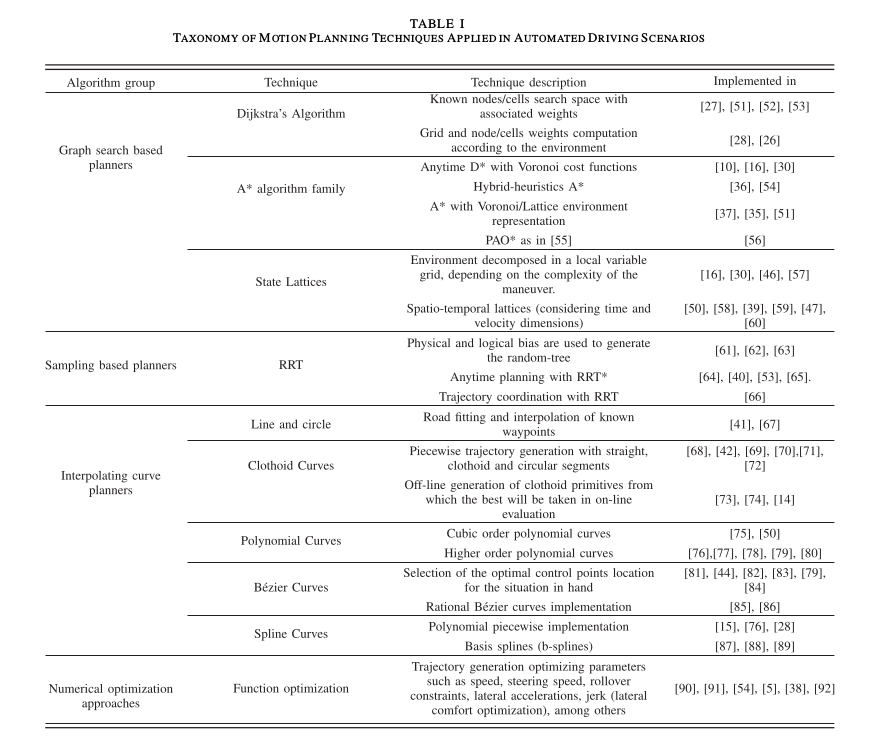
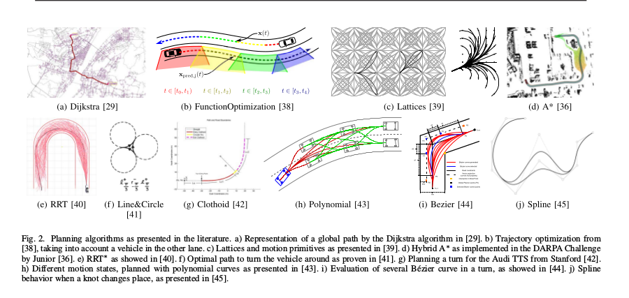

## MP Algorithms 

Families of MP Algorithms are given below.

Reference: **A Review of Motion Planning Techniques for Automated Vehicles**
**David González, Joshué Pérez, Vicente Milanés, and Fawzi Nashashibi**

  

Path Planning
1. Dynamic Window Approach
2. Grid Based Search
   1. Dijkstra algorithm        - WIP
   2. A* Algorithm
   3. Potential Field Algorithm
3. State Lattice Planning
   1. Biased Polar Sampling
   2. Lane Sampling
4. Probabilistic Road Maps
5. Rapidly Exploring Random Trees
   1. RRT*
   2. RRT* with reed sheep path
   3. LQR-RRT*
6. Quintic Polynomials Planning
7. Reed Shepp Planning
8. LQR Based path planning 
9. Optimal Trajectory in Frenet Frame

Graph Search Based Planners
1. Dijkstra algorithm (2 variants)
2. A* Algorithm family (3 variants)
3. State Lattices (2 variants)
   
Sampling Based Planners
1. RRT (3 variants)

Interpolating Curve Planners
1. Line and Circle 
2. Clothoid Curves (2 variants)
3. Polynomial Curves (2 variants)
4. Bezier Curves (2 variants)
5. Spline Curves (2 variants)

Numerical Optimization Approaches 
1. Function Optimization

